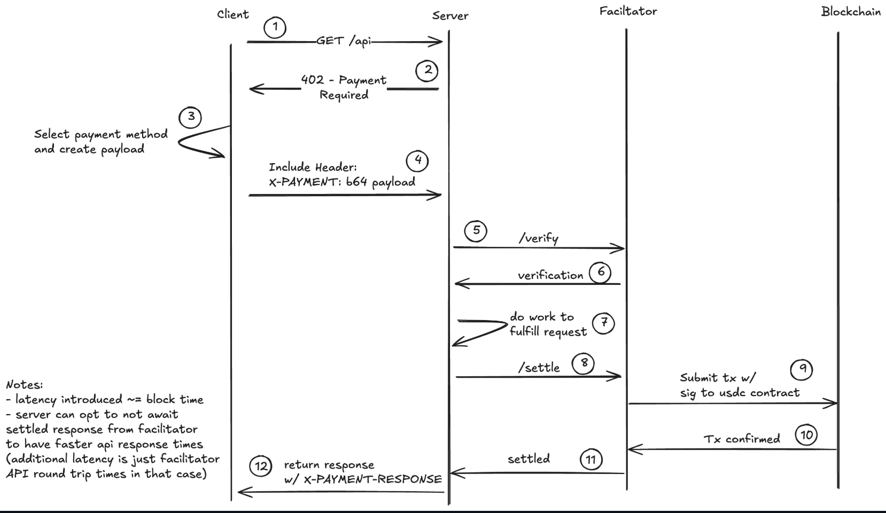

# Settle x402 SDK

TypeScript SDK for seamless gasless USDC transfers on Base using Coinbase’s x402 protocol.  
Powering the next generation of minting, launchpads, and on-chain settlement experiences.

The Settle x402 SDK provides developers with an easy and secure way to send gasless USDC transactions on the Base network using the x402 facilitator protocol (powered by Coinbase Cloudflare).

It is built to simplify complex on-chain settlement flows:

- Gasless USDC transfers
- x402 facilitator integration
- Simplified EIP‑712 transaction signing
- Developer-friendly APIs

---

## Installation

```bash
npm i @settle402/sdk
```

```bash
yarn add @settle402/sdk
```

---

## X402 V1 Protocol Sequencing based on the coinbase facilitator:



## Quick Start: Two-Terminal Setup (Server + Offline Signing)

This guide shows how to:

- Run the server in one terminal
- Perform offline signing and send the `X-PAYMENT` header from another terminal

### Prerequisites

- Node.js 18+ and TypeScript tooling (`typescript`, `ts-node`).
- A valid `~/.master.json` for server config (API keys, endpoints).
- A `.env` file in project root with `PAYER_PK` set to your private key or mnemonic.

Example `.env` (private key):

```plaintext
PAYER_PK=0xaaaaaaaaaaaaaaaaaaaaaaaaaaaaaaaaaaaaaaaaaaaaaaaaaaaaaaaaaaaaaaaa
```

### Configure master setup

The server reads `~/.master.json`. A minimal template:

You can navigate to https://portal.cdp.coinbase.com/products/faucet in your browser to get some test USDC or ETH and navigate to https://portal.cdp.coinbase.com/projects/api-keys to create CDP_API_KEY_ID and CDP_API_KEY_SECRET.

```json
{
  "settle_admin": "0x0000000000000000000000000000000000000000",
  "settle_u1": "0x0000000000000000000000000000000000000000",
  "base_endpoint": "https://mainnet.base.org",
  "base": {
    "CDP_API_KEY_ID": "your-key-id",
    "CDP_API_KEY_SECRET": "your-key-secret"
  },
  "settle_contractAdmin": ["0x0000000000000000000000000000000000000000"],
  "event_endpoint": "https://mainnet.base.org"
}
```

Note:

- Some facilitators only support Base mainnet (`base`) and not Base Sepolia (`base-sepolia`). If you encounter settlement failures (`400`), switch to `base`.

### Terminal 1: Start the server

```bash
npx ts-node src/index.ts --port 3001 --path ./build
```

This starts the Express server and registers routes like:

- `GET /api/weather` → triggers payment flow (`402` then settlement).

If your client targets `http://localhost:4088`, either:

- Run the server with `--port 4088`, or
- Update the client to point at `3001`.

### Terminal 2: Offline signing and payment (client)

```bash
npx ts-node offisig.ts
```

What `offisig.ts` does:

- Calls `/api/weather`, receives `402` JSON with `accepts` payment requirements.
- Builds EIP‑712 TransferWithAuthorization, signs offline using `PAYER_PK`.
- Sends `X-PAYMENT` header with a base64 payload and retries the request.
- On success (`200`), reads `x-payment-response` from response headers, decodes the settlement result, and logs resource data.

---

## Payment Flow

1. Client requests `/api/weather`.
2. Server returns `402 Payment Required` with:
   - `x402Version`
   - `error` (if any)
   - `accepts` (array of `PaymentRequirements` including price, asset, network, timeout)
3. Client signs EIP‑712 `TransferWithAuthorization` offline:
   - Domain: `name: 'USD Coin'`, `version: '2'`, `chainId`, `verifyingContract: USDC address`
   - Message: `{ from, to, value (atomic), validAfter, validBefore, nonce }`
4. Client sends `GET /api/weather` again with header:
   - `X-PAYMENT: <base64 payload>`
5. Server verifies and settles:
   - On success: returns `200` with JSON result and sets `X-PAYMENT-RESPONSE` header (base64)
   - On failure: returns `402` again (with `accepts`) or logs the error

Header casing in Node:

- Axios lowercases header keys; read via `response.headers['x-payment-response']`.

---

## Endpoints

- `GET /api/weather`
  - First call returns `402` with `accepts`
  - After successful settlement, returns `200` with:
    - `success: true`
    - `payer: <address>`
    - `USDC_tx: <tx hash>` (if available)
    - `network`
    - `timestamp`
    - `resource`: demo payload (e.g., weather sample)

Other routes in the server may exist (e.g., `settle001`, `settle01`, etc.) with different price points.

---

## Security Notes

- Never commit private keys or mnemonics to version control.
- `.env` should be in `.gitignore`.
- `PAYER_PK` must be a 32‑byte hex with `0x` prefix, or a valid mnemonic.

---

## Troubleshooting

- 400 Bad Request during `settle(...)`:

  - Check if the facilitator supports your `network`. Many only support `base` (mainnet).
  - Verify `asset` is the USDC contract on that network and supports EIP‑3009 `transferWithAuthorization`.
  - Ensure the `from` wallet has sufficient USDC on the target network.
  - Confirm EIP‑712 domain matches the contract:
    - `name: 'USD Coin'`
    - `version: '2'`
    - `chainId`: `8453` (Base mainnet) or `84532` (Base Sepolia)
    - `verifyingContract`: exact USDC address for that network

- Header decoding error:

  - Only decode `x-payment-response` on `status === 200`.
  - Use lowercase key: `response.headers['x-payment-response']`.
  - Ensure the server sets `X-PAYMENT-RESPONSE` on success (and exposes it via `Access-Control-Expose-Headers`).

- Private key format error:

  - Must be `0x` + 64 hex characters.
  - If using a mnemonic, instantiate the wallet via `Wallet.fromPhrase`.

- Expired or not-yet-valid signature:
  - Adjust `validAfter/validBefore` window to accommodate network delays (e.g., up to 60 seconds).

---

## Optional Validation (Advanced)

After signing, you can statically validate the signature against the USDC contract (no on-chain side effects):

```ts
await usdc.callStatic.transferWithAuthorization(
  message.from,
  message.to,
  message.value,
  message.validAfter,
  message.validBefore,
  message.nonce,
  signature
);
```

If this reverts:

- The signature or domain is wrong, or
- The wallet lacks balance / is blacklisted / contract is paused.

---

## Notes

- The server also sets `Access-Control-Expose-Headers: X-PAYMENT-RESPONSE` so clients can read the settlement header.
- Keep client and server ports consistent (`3001` vs `4088`) to avoid connection issues.
- Logs on the server help diagnose facilitator errors. Consider printing `error.response?.status` and `error.response?.data` when available.

---
